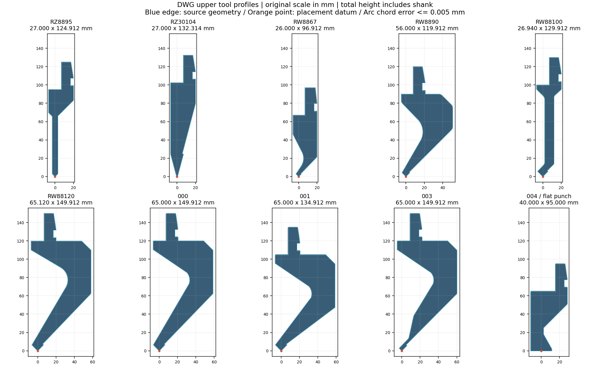

# 从折弯模拟.dwg 提取的刀库

来源：用户提供的 `F:\BaiduNetdiskDownload\资料\折弯模拟.dwg`，2026-09-21 读取。原 DWG 未保存或修改；`source.dwg` 是读取时的副本，SHA-256 记录在 `entities.json` 和 `catalog.json`。AutoCAD 图纸 INSUNITS=4、MEASUREMENT=1，采用毫米原尺寸，不按型号文字推算尺寸。

## 刀型

| 原图块 | 总宽 mm | 总高 mm |
| --- | ---: | ---: |
| RZ8895 | 27.000 | 124.912 |
| RZ30104 | 27.000 | 132.314 |
| RW8867 | 26.000 | 96.912 |
| RW8890 | 56.000 | 119.912 |
| RW88100 | 26.940 | 129.912 |
| RW88120 | 65.120 | 149.912 |
| 000 | 65.000 | 149.912 |
| 001 | 65.000 | 134.912 |
| 003 | 65.000 | 149.912 |
| 004（平底截面） | 40.000 | 95.000 |

总高包含图中刀柄，且从实际圆弧最低点计量，因此不一定等于型号内数字。000、001、003、004 沿用原图块名，不擅自编造厂家型号。004 根据截面标作平底压刀，定位基准为底边中点；仅用于当前姿态的摆放和静态碰撞查看，不代表已实现压平工艺。



## 几何处理

- 只提取上表逐块检查过的轮廓，忽略 CENTER 图层中心线。镜像插入和重复引用不生成重复刀型，可用插件中的“反转方向”。
- 尖头刀定位基准为刀尖圆弧最低点；图纸 XY 平移映射到 `.ztool` 的 XZ，比例 1:1。保留原图直线和已有折线段。
- RZ8895 有两条重复 R0.2 圆弧（255、256）；保留 255。原图直线 253、254 仍延伸至虚拟尖角，按 255 的现有切点修剪这两条线，并验证切点位于原线段内。修剪坐标和句柄详见 `catalog.json`。
- 圆弧以弦逼近，逐段最大弓高不超过 0.005 mm；强制保留各圆弧极值点。此误差只描述从图纸圆弧转换的误差，不包含原图精度、已有折线误差或实际刀具制造误差。细小间隙须考虑此近似。
- 端点连接容差 0.00001 mm，报告实际合并距离；没有自动补线。每个轮廓要求所有端点恰连两条曲线、只有一个闭环、无自交、无内孔。共有 19～80 个点，符合插件上限。
- 下模图块 20070626131823 留在原始数据中，当前插件尚无下模定位与联动，因此未混入上刀列表。机架、夹持件、螺钉和标注不作为上刀。

## 重建与安装

`tools/extract_dwg.py` 使用已安装 AutoCAD 的 ObjectDBX 只读打开副本，导出解析数据，需要 pywin32。`tools/convert_dwg_tools.py` 从这些数据生成 `.ztool`、目录 JSON 和对照图，需要 shapely、matplotlib。提取只接受已核对的毫米图纸，转换器对未审查的曲线类型或断开的轮廓报错。

```powershell
python tools/convert_dwg_tools.py tool-library/dwg-20260921
cmake --build build-codex --config Release
python tools/deploy.py
python tools/install_tool_library.py
```

`deploy.py` 将 10 个文件打包在 `D:\UG智辉钣金插件\application\ZeWanMoNiTools` 并更新清单；安装脚本核对其 SHA-256 后复制缺少的文件到 `D:\UG智辉钣金插件\刀图`，同时复制旧用户目录中的自定义刀具并保留原图。已有同名文件会备份并保留原内容，防止覆盖用户在 NX 列表中修改的名称。移入 `刀图\已删除` 的文件不会被安装脚本自动恢复。NX 中重新打开“折弯模拟”，即可看到 `DWG …` 条目。

此操作预装本次图纸的 10 个截面；其他 DWG 可在插件中选择文件、预览候选轮廓，再保存所需刀具。
